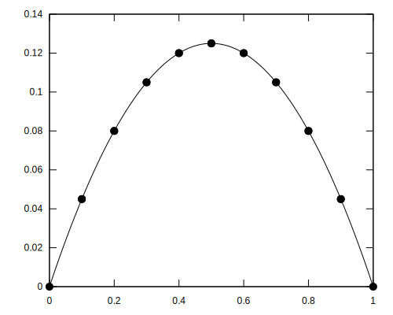

# c-dg-fem-1d

An example Discontinuous Galerkin Finite Element code in 1D written in C, using Legendre or Lagrange polynomials. Made as a learning experience for myself and for educational purposes.




*Figure: Poisson solution with degree 2 Legendre elements*


## Usage

The code is structured to provide a static library allowing the assembly of linear systems given any weak form problem. Lets take for example the poisson equation:

$$
    - \Delta u = f
$$

Choosing test functions $v$ and integration over an element $\Omega_i \in \Omega$ leads to:

$$
    - \int_{\Omega_i} v \Delta u \, d\Omega_i = \int_{\Omega_i} v f \, d\Omega_i
$$

Integrating by parts adds a boundary term over the element boundary $\Gamma_i$

$$
    \int_{\Omega_i} \nabla v \cdot \nabla u \, d\Omega_i - \int_{\Gamma_i} v \left(\nabla u \cdot n\right) \, d\Gamma_i = \int_{\Omega_i} v f \, d\Omega_i
$$

The fluxes on the faces must be reconstructed, since two states exist, one for each cell next to the face $u^-$ and $u^+$. Defining the average and jump operators:

$$
    \left\lbrace v\right\rbrace = \frac{v^- + v^+}{2}
$$

$$
    \left[v\right] = v^+ - v^-
$$

Using the interior penalty Discontinuous Galerkin method (IPDG), we can write the boundary integral as:

$$
- \int_{\Gamma_i} v \left(\nabla u \cdot n\right) \, d\Gamma_i
= \int_{\Gamma_i} \left(\left\lbrace\nabla u \cdot n\right\rbrace\left[v\right] - \delta \left\lbrace\nabla v \cdot n\right\rbrace\left[u\right] + \frac{\alpha}{h}\left[v\right]\left[u\right] \right) d\Gamma_i 
$$

Where $\delta$ is either -1, 0 or 1, $\alpha$ is a penalty parameter for the jump between elements, and $h$ is a local cell scale (cell width). 

The overall weak form is:

$$
    \int_{\Omega_i} \nabla v \cdot \nabla u \, d\Omega_i + \int_{\Gamma_i} \left(\left\lbrace\nabla u \cdot n\right\rbrace\left[v\right] - \delta \left\lbrace\nabla v \cdot n\right\rbrace\left[u\right] + \frac{\alpha}{h}\left[v\right]\left[u\right] \right) d\Gamma_i = \int_{\Omega_i} v f \, d\Omega_i
$$


Implementing this in dg-fem-1d requires an assembly function for the internal integral over $\Omega_i$, one for the rhs integral over $\Omega_i$, and one for the boundary integral $\Gamma_i$. 

Assembly functions take as input a simple struct type `shape_t` which has the following structure:

```c
typedef struct {
    double value;
    double grad;
} shape_t;
```

The interior assembly function for this case is:

```c
double interior_lhs(
    shape_t u,
    shape_t v,
    double dx,
    assembly_data_t data,
    void* user_data
) {
    return v.grad * u.grad * dx;
}
```

Assembly functions pass an assembly data struct which contains information about the status of assembley, including the current quadrature point. An additional pointer to any user provided data can be passed also for per example physical properties arrays. The rhs assembly is:

```c
double interior_rhs(
    shape_t v,
    double dx,
    assembly_data_t data,
    void* user_data
) {
    double f = data.x;  // here we choose the forcing term f = x
    return f * v.value * dx;
}
```

The flux formulation is more involved:

```c
double numerical_flux(
    shape_t u0,
    shape_t v0,
    shape_t u1,
    shape_t v1,
    double n,
    double ds,
    double h, 
    assembly_data_t data,
    void* user_data
) {
    int degree = *((int*)user_data);

    double delta = -1.0;
    double d = ((double)degree);
    double alpha_stab = d * (d + 1.0) / h;
    if (degree == 0) {
        alpha_stab = 1.0 / h;
    }

    return (
                  0.5 * (u1.grad*n + u0.grad*n) * (v1.value - v0.value)
        - delta * 0.5 * (v1.grad*n + v0.grad*n) * (u1.value - u0.value)
        + alpha_stab  * (v1.value  - v0.value)  * (u1.value - u0.value)
    ) * ds;
}
```

Cell 0 is the current cell, and cell 1 is the other cell. The jump evaluation must always be other cell - current cell.


## Building

Building is done using make, and the only dependency is the standard c library. Only tested on linux. Calling `make` will create a static library under `build/lib/libdg1d.a` and an example executable under `build/example`.


## Example script

The example script tests two problems, a poisson equation and a convection equation. A #define macro allows switching between the two problems definitions at compilation. Calling it from the project root directory via:
```bash
./build/main <n cells> <degree>
```

Will run the compiled case with `n cells` and polynomial `degree`. The solution is written to plot/data.txt and plot/edges.txt, and can be visualized using a *gnuplot* script plot/plot.gpl. 

L2 and H1 norms of the error are also appended to a plot/error.txt file. Running multiple times the example script with different parameters will append to this file, and the convergence curve can be visualized using the plot/plot_error.gpl gnuplot script.


## Verification

Verification was done using Legendre polynomials.

### Poisson

Using the manufactured exact solution:

$$
    u(x) = \sin(2\pi x)
$$

And the poisson equation:
$$
    -\Delta u = f
$$

The forcing term is:

$$
    f = - \left(2\pi\right)^2 \sin(2\pi x)
$$

Order of convergences tested on the poisson case for degree 0 to 3 elements are:

| Degree   | L2 / theo.  | H1 / theo. |
| -------- | ----------- | ---------- |
| 0        |  1.002 /  1 | 0.000 / 0  |
| 1        |  1.924 /  2 | 1.004 / 1  |
| 2        |  2.995 /  3 | 2.004 / 2  |
| 3        |  3.892 /  4 | 3.026 / 3  |
| 4        |  4.991 /  5 | 4.006 / 4  |
| 5        |  6.226 /  6 | 5.038 / 5  |
| 6        |  6.958 /  7 | 6.001 / 6  |
| 7        |  8.202 /  8 | 7.262 / 7  |
| 8        |  8.597 /  9 | 7.991 / 8  |
| 9        | 10.327 / 10 | 9.491 / 9  |


### Convection

Using the manufactured exact solution:

$$
    u(x) = \frac{2x^2}{x+1}-\frac{x^3}{2}
$$

And the convection equation:

$$
    \nabla u = f
$$

The forcing term is:

$$
    f = \frac{x\left(-3x^3-6x^2+x+8\right)}{2\left(x+1\right)^2}
$$

Order of convergences tested on the convection case for degree 0 to 3 elements are:

| Degree   | L2 / theo. | H1 / theo. |
| -------- | ---------- | ---------- |
| 0        | 1.009 / 1  | 0.000 / 0  |
| 1        | 1.995 / 2  | 0.999 / 1  |
| 2        | 2.995 / 3  | 2.000 / 2  |
| 3        | 3.700 / 4  | 2.816 / 3  |
| 4        | 4.984 / 5  | 3.990 / 4  |
| 5        | 5.785 / 6  | 4.816 / 5  |
| 6        | 6.735 / 7  | 5.760 / 6  |
| 7*       | 7.673 / 8  | 6.702 / 7  |
| 8*       | 8.031 / 9  | 7.077 / 8  |
| 9*       | 8.872 / 10 | 7.936 / 9  |

*Note that for high order elements, norm of error with only 1 or 2 cells was already close to machine precision.
